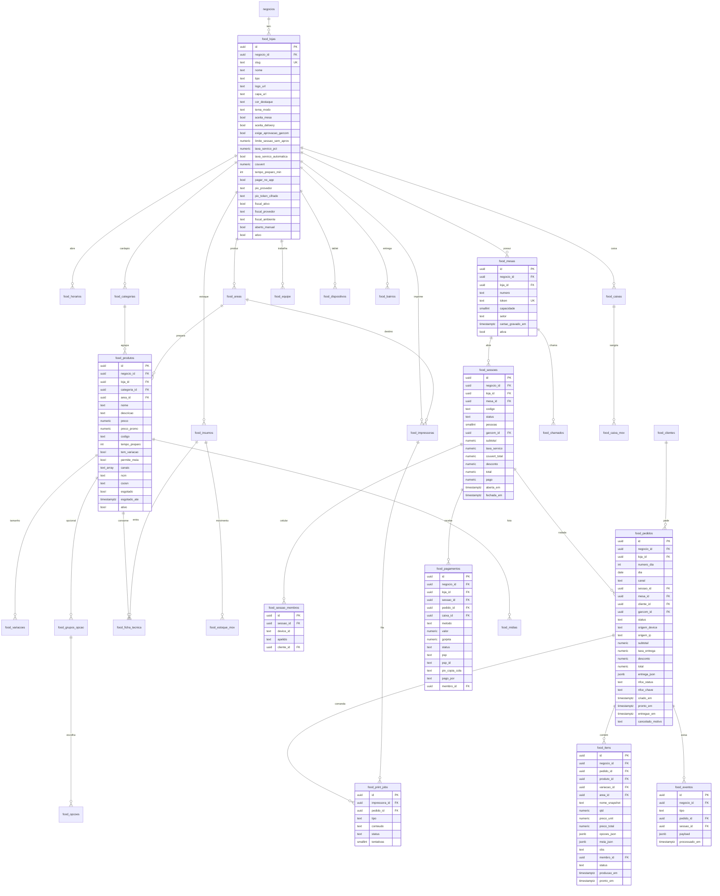

# 00. Inventário do módulo AppFood

Due diligence técnica, rodada de diagnóstico. Nada foi alterado no código.

**Escopo auditado**: o módulo `food` dentro do repositório `enderecodigital-hub`
(`C:\Users\Eliezer\Desktop\PROJETO-VSCODE\enderecodigital-hub`). A pasta
`Desktop\appfood` guarda só o plano comercial e não tem código.

**Método**: leitura dos arquivos citados, varredura por `grep`, uma consulta de
leitura ao banco de produção (fuso e contagem de tabelas) e chamadas HTTP contra
o app rodando em `localhost:3010`. Toda afirmação abaixo tem `arquivo:linha`.

**Tamanho**: 5.388 linhas entre schema, lib, API e telas do módulo (fora os
componentes de outros módulos do hub).

---

## 1. Stack

| Item | O que é | Evidência |
|---|---|---|
| Framework | Next.js 16.2.10, App Router, React 19 | `package.json:26` |
| Runtime | Node (rotas com `export const dynamic = "force-dynamic"`) | `app/api/food/publico/route.ts:17` |
| Banco | PostgreSQL, acesso direto por `pg` 8 | `package.json:28`, `lib/db.ts:1` |
| ORM | Nenhum. SQL escrito à mão, sempre parametrizado (`$1`) | `lib/db.ts:18` |
| Migrations | Arquivos `.sql` numerados, aplicados por script próprio | `db/instalar-food.mjs` |
| Pacotes | npm (`package-lock.json`) | raiz |
| Sessão | JWT assinado com `jose`, cookie httpOnly | `lib/auth.ts:27`, `lib/session.ts` |
| Senha e PIN | bcryptjs | `lib/auth.ts:12` |
| Estilo | Tailwind 3.4 + CSS próprio do food | `app/food-cliente.css`, `app/food-theme.css` |
| Hospedagem | Docker + Coolify, deploy por push na `main` | `Dockerfile`, `docs/appfood-contexto.md` |
| Testes | Scripts `.mjs` com PGlite (Postgres em memória) e um teste HTTP ponta a ponta | `db/testes/` |
| Validação de entrada | Nenhuma biblioteca (sem Zod, Yup ou class-validator) | busca sem resultado em `package.json` |
| Monitoramento | Nenhum (sem Sentry ou equivalente) | busca sem resultado no repositório |

Banco de produção hoje: **29 tabelas `food_*`** (confirmado por consulta ao
`information_schema`).

---

## 2. Mapa de rotas e páginas

### 2.1 Cliente final (sem login)

| Rota | Quem acessa | O que faz | Arquivo |
|---|---|---|---|
| `/c/[slug]` | Qualquer um com o link | Cardápio de vitrine, sem pedir | `app/c/[slug]/page.tsx` |
| `/c/[slug]/m/[token]` | Quem encostou o celular no cartão NFC (ou quem tiver o link) | Mesa: cardápio, carrinho, comanda, chamar garçom, Pix | `app/c/[slug]/m/[token]/page.tsx`, `components/food/mesa-app.tsx` |
| `/c/[slug]/pedir` | Qualquer um com o link | Delivery e retirada | `app/c/[slug]/pedir/page.tsx`, `components/food/delivery-cliente.tsx` |

### 2.2 Operação da casa (sem login, autorização por token na URL)

| Rota | Quem acessa | O que faz | Arquivo |
|---|---|---|---|
| `/k/[token]` | Tablet ou TV da cozinha | KDS: fila de comandas, marcar fazendo/pronto/entregue | `app/k/[token]/page.tsx`, `components/food/kds-app.tsx` |
| `/g/[token]` | Tablet do garçom | Mapa de mesas, lançar pedido, receber, fechar conta | `app/g/[token]/page.tsx`, `components/food/garcom-app.tsx` |

### 2.3 Painel do dono (exige login)

| Rota | Quem acessa | O que faz | Arquivo |
|---|---|---|---|
| `/food/[neg]` | `dono`, `operador` do negócio, `owner_plataforma` | Salão: mapa de mesas, chamados, pedidos do dia, resumo | `app/food/[neg]/page.tsx`, `components/food/painel-salao.tsx` |
| `/food/[neg]/cardapio` | idem | Cardápio: categorias, produtos, variações, opções, fotos, reajuste | `app/food/[neg]/cardapio/page.tsx`, `components/food/cardapio-admin.tsx` |
| `/food/[neg]/mesas` | idem | Mesas e gravação do cartão NFC | `app/food/[neg]/mesas/page.tsx`, `components/food/mesas-cartoes.tsx` |
| `/food/[neg]/caixa` | idem | Caixa do dia, pagamentos | `app/food/[neg]/caixa/page.tsx`, `components/food/caixa-food.tsx` |
| `/food/[neg]/delivery` | idem | Pedidos de entrega e despacho | `app/food/[neg]/delivery/page.tsx` |
| `/food/[neg]/estoque` | idem | Insumos, ficha técnica, CMV | `app/food/[neg]/estoque/page.tsx` |
| `/food/[neg]/config` | idem | Loja, áreas, impressoras, tablets, equipe, horários, bairros | `app/food/[neg]/config/page.tsx`, `components/food/config-loja.tsx` |

O controle de acesso do painel **não está no middleware**: `/food` não aparece na
lista pública (`middleware.ts:5-26`), então cai na exigência de sessão
(`middleware.ts:40-60`); a checagem de qual negócio a pessoa pode ver acontece
dentro da API, em `negocioPermitido()` (`lib/food-auth.ts:11-17`).

---

## 3. Mapa de endpoints da API

| Método e caminho | Recebe | Devolve | Exige autenticação |
|---|---|---|---|
| `POST /api/food/publico` `acao=cardapio_slug` | `slug` | loja pública + cardápio | Não |
| `POST /api/food/publico` `acao=cardapio_delivery` | `slug` | cardápio, bairros, se está aberta | Não |
| `POST /api/food/publico` `acao=pedido_delivery` | `slug`, `itens[]`, nome, telefone, bairro, endereço | número do pedido e total | Não |
| `POST /api/food/publico` `acao=entrar` | `token` da mesa, `deviceId`, apelido | sessão, membroId, cardápio, resumo | Token da mesa |
| `POST /api/food/publico` `acao=resumo` | `token` | comanda inteira da mesa | Token da mesa |
| `POST /api/food/publico` `acao=pedir` | `token`, `itens[]` (ids e qtd), `membroId`, obs | pedido criado | Token da mesa |
| `POST /api/food/publico` `acao=chamar` | `token`, tipo | ok | Token da mesa |
| `POST /api/food/publico` `acao=pagar` | `token`, `valor`, `gorjeta` | Pix copia e cola | Token da mesa |
| `GET /api/food/kds?token=` | token do dispositivo | itens da praça + chamados | Token do dispositivo |
| `POST /api/food/kds` | `token`, `acao` (item, pedido, chamado) | ok | Token do dispositivo |
| `GET /api/food/garcom?token=` | token do dispositivo | mesas, cardápio, equipe, chamados | Token do dispositivo |
| `POST /api/food/garcom` | `token`, `acao` (pin, sessao, pedido, pagamento, fechar, chamado) | conforme a ação | Token do dispositivo |
| `GET /api/food/painel?neg=&vista=` | `neg`, `loja`, `vista` | salao, cardapio, mesas, pedidos, sessao, delivery, config, estoque, caixa, relatorio | Sessão + `negocioPermitido` |
| `POST /api/food/painel` | `neg`, `acao` (55 ações) | conforme a ação | Sessão + `negocioPermitido` |
| `POST/GET/DELETE /api/food/print/[chave]` | chave da impressora na URL | texto da comanda (CloudPRNT ou JSON) | Chave da impressora |
| `POST /api/food/webhook/[psp]` | aviso do PSP | ok | Nenhuma (confere no PSP antes de baixar) |
| `GET /api/food/midia/[id]` | id da mídia | bytes da imagem | **Cai no login (ver achado QUEBRADO abaixo)** |
| `GET/POST /api/food/eventos` | `Authorization: Bearer CRON_SECRET` | fila processada | Cron secret ou `owner_plataforma` |

Rotas liberadas sem sessão, na íntegra: `middleware.ts:18-25`
(`/c`, `/k`, `/g`, `/api/food/publico`, `/api/food/print`, `/api/food/kds`,
`/api/food/garcom`, `/api/food/webhook`).

---

## 4. Schema do banco

Fonte: `db/migration_0003_food.sql` (577 linhas) e
`db/migration_0004_food_edicao.sql` (60 linhas). Toda tabela tem
`negocio_id NOT NULL` com índice, exceto `food_contadores`.



Tabelas não desenhadas acima por serem folhas simples: `food_clientes`,
`food_caixa_mov`, `food_estoque_mov`, `food_contadores`, `food_midias`,
`food_horarios`, `food_chamados`, `food_bairros`.

### Restrições que sustentam o modelo

| Restrição | Onde | O que garante |
|---|---|---|
| `uq_food_sessao_viva` (índice único parcial em `mesa_id` quando o status é vivo) | `db/migration_0003_food.sql:308-310` | Uma comanda viva por mesa |
| `UNIQUE (loja_id, numero)` em mesas | `:124` | Não duplica mesa 7 |
| `UNIQUE (sessao_id, device_id)` em membros | `:318` | Um celular entra uma vez |
| `UNIQUE (loja_id, dia, numero_dia)` em pedidos | `:378` | Número do pedido não repete no dia |
| `uq_food_pag_psp (psp, psp_id)` | `:459` | Webhook do Pix é idempotente |
| `food_mesas.token UNIQUE` | `:120` | Cartão NFC é a chave |
| `CHECK` de status em pedidos, itens, sessões, pagamentos | vários | Estado inválido não entra no banco |

**Dinheiro**: tudo em `NUMERIC(10,2)` ou `NUMERIC(12,2)`, nunca float
(`:355-378`, `:434-446`). Não são centavos inteiros, mas `NUMERIC` do Postgres é
decimal exato, então não há erro de arredondamento binário no banco.

---

## 5. Modelo de autenticação

Existem **quatro** identidades diferentes, e nenhuma delas conversa com a outra:

1. **Dono do painel**: e-mail e senha em `/login`, cookie JWT httpOnly assinado
   com `jose` (`lib/auth.ts:27-37`). O papel vem no token (`owner_plataforma`,
   `dono`, `operador`, `parceiro`). Quem pode operar qual negócio:
   `lib/food-auth.ts:11-17`.
2. **Cliente da mesa**: **não é identificado**. A autorização é o token opaco da
   mesa que vai gravado no cartão NFC (`food_mesas.token`, 12 bytes aleatórios em
   base64url, `lib/food.ts:20-22`). O `deviceId` é gerado pelo próprio navegador
   e guardado em `localStorage` (`components/food/mesa-app.tsx:36-37`); o servidor
   aceita o que vier, sem emitir nada.
3. **Tablet da cozinha e do garçom**: token do dispositivo na URL
   (`food_dispositivos.token`), sem expiração e sem vínculo com pessoa
   (`app/api/food/kds/route.ts:13-27`, `app/api/food/garcom/route.ts:16-24`).
   O PIN do garçom existe (`food_equipe.pin_hash`, verificado em
   `app/api/food/garcom/route.ts:54-63`) mas o resultado só é guardado no
   `localStorage` do tablet; nenhuma ação posterior exige o PIN.
4. **Impressora**: a chave na URL (`food_impressoras.chave`, 16 bytes).

---

## 6. Tempo real

**Não existe WebSocket nem SSE em nenhum lugar do módulo.** Tudo é polling com
`setInterval`:

| Tela | Intervalo | Evidência |
|---|---|---|
| KDS da cozinha | 5 s (e um re-render forçado a cada 20 s só para o relógio) | `components/food/kds-app.tsx:39-40` |
| Painel do salão | 8 s | `components/food/painel-salao.tsx:62` |
| Celular na mesa | 10 s (só o resumo, o cardápio não recarrega nunca) | `components/food/mesa-app.tsx:90` |
| Tablet do garçom | 10 s | `components/food/garcom-app.tsx:57` |
| Impressora CloudPRNT | 2 s com fila, 5 s sem | `app/api/food/print/[chave]/route.ts:41` |

Cada tick refaz a consulta inteira, então **queda de conexão não perde ticket**:
quando a rede volta, o próximo `setInterval` traz o estado completo. O preço
disso é carga constante no banco e latência de até 5 s para a cozinha.

---

## 7. O que está claramente inacabado

### 7.1 Varreduras

- `TODO|FIXME|HACK|XXX|@ts-ignore`: **zero ocorrências** em `app/`, `lib/`, `db/`
  e `components/` do módulo food. Os poucos hits do repositório são a palavra
  "TODO" em português dentro de comentários de outros módulos.
- `console.log|warn|error` em arquivos do food: **zero**.
- Sem arquivo de stub, sem rota devolvendo mock, sem teste comentado.
- Segredos hardcoded: **nenhum**. Tudo vem de `process.env`. `.env` e
  `.env.local` estão no `.gitignore:5-7`.

O código não tem sujeira. O que falta, falta por inteiro, e é isso que a lista
abaixo mostra.

### 7.2 Campos e estados que existem no banco e ninguém usa

| O que | Onde nasce | Por que está morto |
|---|---|---|
| `food_categorias.turnos`, `hora_inicio`, `hora_fim` | `migration_0003:139-141`, editável em `components/food/cardapio-admin.tsx:873` | `montarCardapio()` nunca filtra por horário (`lib/food.ts:227-241`). Cardápio de café aparece na janta. |
| `food_produtos.esgotado_ate` | gravado em `lib/food.ts:356` e `lib/food-edicao.ts:447` | Nenhuma consulta lê essa coluna. O "volta sozinho amanhã" do comentário não existe. |
| `food_sessoes.desconto` | `migration_0003:299`, entra no total em `lib/food.ts:524` | Nenhum endpoint grava desconto. Não dá para dar desconto pelo sistema. |
| Status de sessão `aguardando_pagamento` e `cancelada` | `migration_0003:288` | Nenhum `UPDATE` no código escreve esses dois valores. |
| Status de pagamento `estornado`, `falhou`, `expirado` | `migration_0003:449` | Nenhum código escreve. Não existe estorno. |
| `food_pedidos.nfce_*` | `migration_0003:368-370` | Módulo fiscal não foi escrito (decisão consciente, `docs/appfood-contexto.md`). |
| `food_itens.meia_json` e `food_produtos.permite_meia` | `migration_0003:391`, `:151` | `criarPedido()` ignora `it.meia` (`lib/food.ts:662-687`). Pizza meia a meia não funciona. |
| `food_opcoes.insumo_id` e `insumo_qtd` | `migration_0003:207-208` | `baixarEstoque()` só olha a ficha técnica do produto (`lib/food.ts:1217-1227`). Adicional não baixa estoque. |
| `food_grupos_opcao.minimo`, `maximo`, `obrigatorio`, `tipo_preco` | `migration_0003:180-184` | Só o navegador respeita (`components/food/mesa-app.tsx:352-359`). O servidor não valida nada disso. |
| `food_equipe.papel` e `comissao_pct` | `migration_0003:230-232` | Papel não muda permissão em lugar nenhum. Comissão não é calculada. |
| `food_lojas.fuso` | `migration_0003:43` | Nenhuma consulta usa. Tudo roda em UTC (ver achado no `01-lacunas.md`). |
| `food_clientes.cpf`, `nascimento`, `endereco_json` | `migration_0003:216-221` | Só o telefone e o nome são preenchidos. |

### 7.3 Telas e funções previstas que não existem

- **Nenhuma tela de relatório** além do resumo do dia (`lib/food.ts:1281-1317`):
  faturamento, ticket, top 10 produtos e quebra por canal. Não há tempo por
  praça, curva de horário nem itens mais cancelados.
- **Nenhuma divisão de conta.** Busca por "dividir", "split" ou "por pessoa" no
  módulo: zero resultados. O `membro_id` está gravado no item
  (`food_itens.membro_id`) mas nada consome.
- **Nenhum campo de alergênico ou restrição alimentar** no schema inteiro. Busca
  por "alerg", "gluten", "lactose", "vegan", "castanha": zero resultados.
- **Nenhum Kanban.** O KDS agrupa por número de pedido em cartões
  (`components/food/kds-app.tsx:55-60`), sem colunas de estado, sem filtro por
  praça na tela (a praça é fixa no token do tablet), sem som, sem desfazer, sem
  botão 86 e sem indicação de offline.
- **Nenhum teste de isolamento entre clientes.** Os três scripts de teste
  (`db/testes/`) cobrem estrutura, consultas críticas e um fluxo ponta a ponta de
  23 checagens. Nenhum tenta ler dado de outro estabelecimento.

### 7.4 Um achado de campo, confirmado no ar

`GET /api/food/midia/<id>` **não está na lista de rotas públicas do
middleware** (`middleware.ts:18-25`). Testado agora contra o servidor local:

```
curl -D - http://localhost:3010/api/food/midia/76b69353-...
HTTP/1.1 307 Temporary Redirect
location: /login
```

Ou seja: **toda foto de produto enviada pelo dono aparece quebrada no celular do
cliente**, porque a imagem redireciona para a tela de login. Detalhado como P1 no
`01-lacunas.md`.

### 7.5 Medição da página do cardápio

Medido em `localhost:3010` (modo dev, então o JavaScript não é representativo do
build de produção):

| Item | Peso |
|---|---|
| HTML de `/c/boteco-demo` | 19,2 KB |
| Payload JSON do cardápio (`acao=cardapio_slug`) | 6,3 KB |
| Imagens | 0 bytes servidos, porque a rota de mídia redireciona para o login |

Sem `srcset`, sem `loading="lazy"`, sem `next/image`: as fotos entram como `` cru (`components/food/mesa-app.tsx:159`). O formato depende do que o
navegador do dono gerou no upload; o padrão gravado é `image/webp`
(`migration_0004:19`) com teto de 2 MB por arquivo (`lib/food-edicao.ts:322`).
